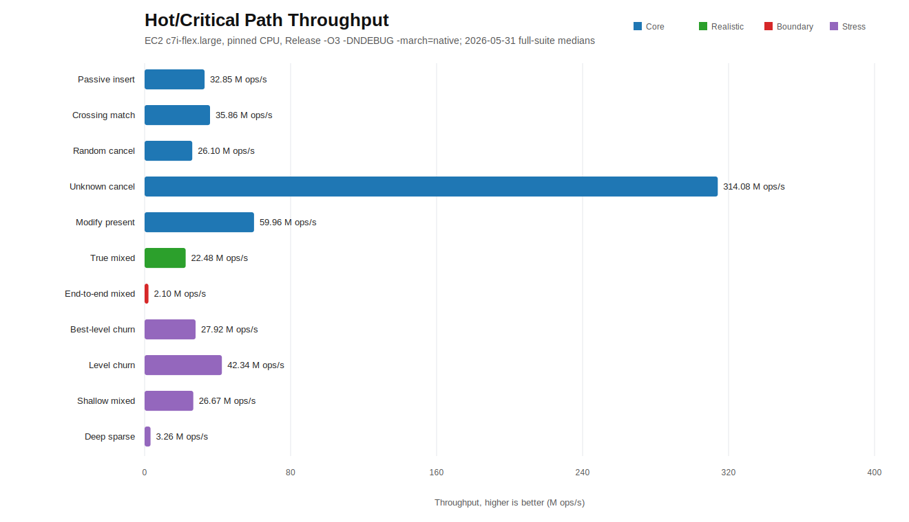
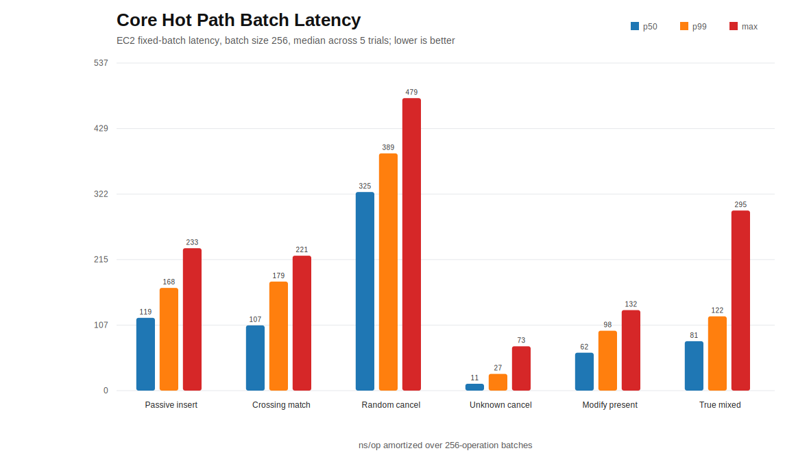
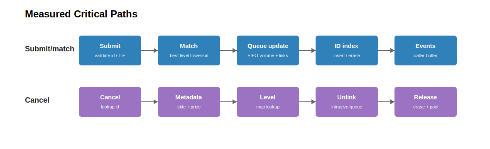
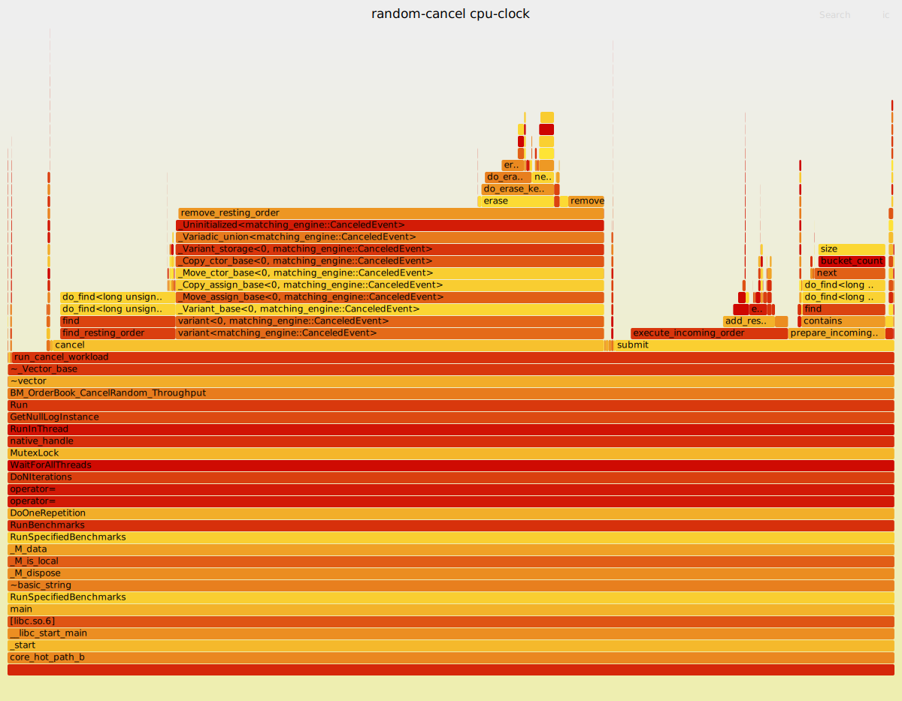
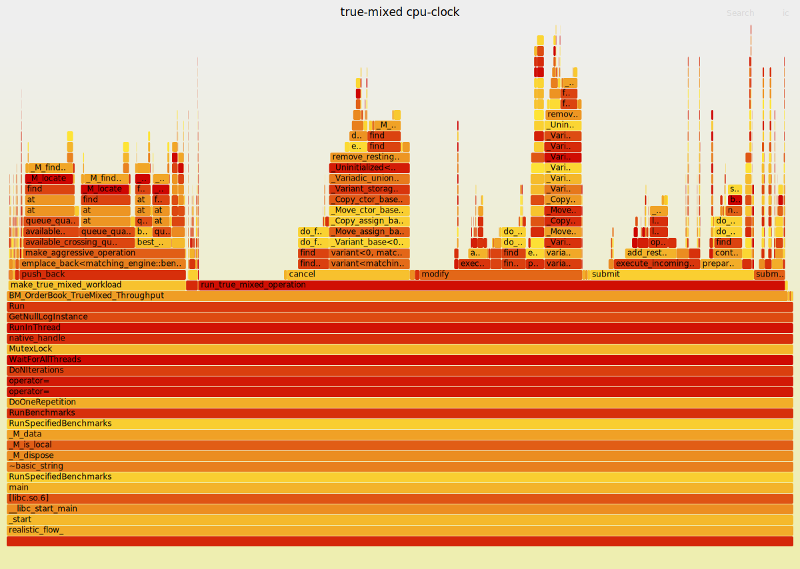
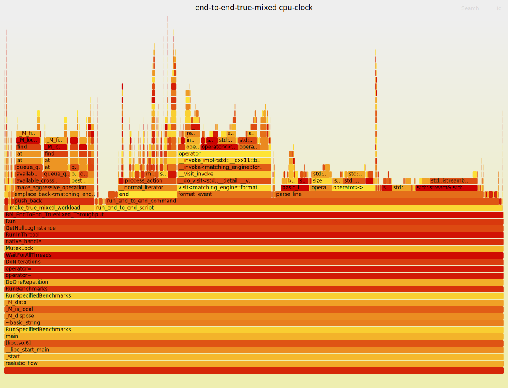
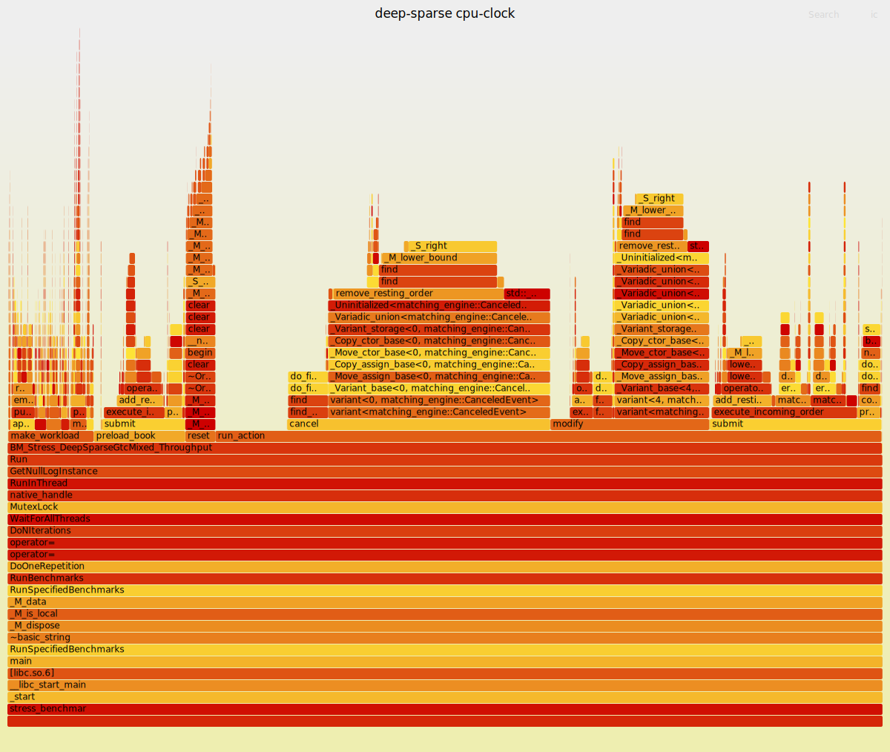

# Benchmarks

## Executive Summary

Latest focused core/realistic/std-toy comparison run: pinned-core EC2/Linux run on `2026-05-23T08:54:21Z`.

Latest full suite including stress and replay remains the pinned-core EC2/Linux run from `2026-05-23T08:10:34Z`.

The current documentation snapshot intentionally combines those two runs:
core/realistic throughput and std-toy comparison rows come from `08:54:21Z`;
stress, replay, profiling artifacts, and core batch-latency rows come from the
`08:10:34Z` full-suite run unless a row says otherwise.

| Item | Latest EC2 Run |
| --- | --- |
| Environment | AWS EC2 `c7i-flex.large`, Ubuntu Linux, `taskset -c 0` |
| CPU | Intel Xeon Platinum 8488C |
| Compiler | GCC/G++ 15.2.0 |
| Build flags | `-O3 -DNDEBUG -march=native` |
| Framework | Google Benchmark for throughput; custom fixed-batch latency runner |
| Validation | 130/130 CTest cases passed before benchmarks |
| Source | Local tree at `7a5980e1` with uncommitted std-toy comparison benchmark and EC2 runner changes |

| Highlight | Metric |
| --- | ---: |
| OrderBook true mixed hot path, 100,000 operations | `23.12M ops/sec` |
| OrderBook true mixed p99 batch latency, 256-op batches | `0.092 us/op` |
| End-to-end true mixed flow, 100,000 commands | `2.21M commands/sec` |
| End-to-end true mixed p99 batch latency, 256-command batches | `0.541 us/op` |
| Largest optimized-vs-std-toy gap, unknown cancel at 10,000 operations | `1,642.78x` |
| Best-level churn stress, 1,000,000 operations | `27.97M ops/sec` |

The suite separates direct matching-core performance from public-boundary cost. Hot-path results isolate `OrderBook`; end-to-end results include parser, exchange routing, matching, and event formatting.



Historical benchmark development before the `v0.9.4` refresh was performed on EC2 `t3.small`. The `v0.9.4` benchmark suite was rerun on EC2 `c7i-flex.large` for more stable sustained CPU performance and profiling consistency. Historical rows remain labeled with their original hardware and should not be read as c7i results.

## Benchmark Methodology

The numbers in this report come from a clean Release build on Linux/EC2 with CPU pinning enabled via `taskset -c 0`. The benchmark runner records environment metadata, commit hash when available, compiler version, build type, flags, selected benchmark targets, and system CPU details.

Rigor controls:

| Control | Practice |
| --- | --- |
| Build mode | Release build with `-O3 -DNDEBUG -march=native` |
| CPU noise | Fixed CPU affinity / pinned core; note any missing `taskset` support |
| Workload repeatability | Fixed RNG seeds and deterministic pre-generated workloads |
| Timing boundaries | Setup, allocation, preload, and RNG generation outside measured loops |
| Memory behavior | Reusable event buffers; reserve hints sized from modeled live depth where applicable |
| I/O | No filesystem I/O inside timed benchmark loops |
| Latency | Amortized fixed-batch latency, not true single-operation latency |
| Compiler barriers | `benchmark::DoNotOptimize(...)` and `benchmark::ClobberMemory()` where benchmarked state/results must stay visible |
| Validation | Correctness tests before EC2 benchmark execution |

Hot-path benchmarks measure typed matching operations directly against `OrderBook`. Realistic-flow benchmarks measure either the same mixed order stream on `OrderBook` or the public parser/exchange/formatter path. The std-toy comparison target runs the same direct book workloads against the optimized implementation and the simple std-container baseline at 10,000 operations per row. Stress benchmarks target adversarial book shapes. Replay benchmarks exercise deterministic fixture streams through the public path.

Core and realistic-flow throughput rows below use the `2026-05-23T08:54:21Z`
focused refresh. Core batch-latency, stress, replay, and profiling rows use the
`2026-05-23T08:10:34Z` full-suite refresh.

## Core Hot Path

Core hot-path benchmarks measure the matching engine without parser, CLI, filesystem, or formatting overhead. These are the best indicators of data-structure cost in the matching core.

### Throughput

| Benchmark | Description | Input Size | Throughput |
| --- | --- | ---: | ---: |
| Passive Insert | Non-crossing GTC limit orders resting on the book | 100,000 operations | `33.64M ops/sec` |
| One-Level Crossing Match | Aggressive orders consuming resting liquidity at one price level | 100,000 operations | `32.40M ops/sec` |
| Random Cancel | Cancel by live order id with shuffled lookup order | 100,000 operations | `25.85M ops/sec` |
| Unknown Cancel | Rejected cancel path through the order-id lookup miss path | 100,000 operations | `332.12M ops/sec` |
| Modify If Present | Same-price quantity reduction preserving FIFO priority | 100,000 operations | `62.28M ops/sec` |

### Latency

Latency rows report the median across five trials at 256 operations per timed batch. These are amortized batch measurements, not true single-operation latency. The runner does not currently report p999.

| Benchmark | p50 | p99 | p999 | Max |
| --- | ---: | ---: | ---: | ---: |
| Passive Insert | `0.034 us` | `0.060 us` | `N/A` | `0.088 us` |
| One-Level Crossing Match | `0.036 us` | `0.069 us` | `N/A` | `0.090 us` |
| Random Cancel | `0.068 us` | `0.114 us` | `N/A` | `0.153 us` |
| Unknown Cancel | `0.008 us` | `0.012 us` | `N/A` | `0.051 us` |
| Modify If Present | `0.021 us` | `0.030 us` | `N/A` | `0.068 us` |



Engineering notes:

| Observation | Why It Matters |
| --- | --- |
| Intrusive FIFO queues keep cancel and match removal O(1) once the order is found. | This preserves price-time priority while avoiding same-price queue scans. |
| The flat order-id map improves cancel lookup locality. | Random cancels remain cache-sensitive because ids touch the lookup table in shuffled order. |
| Balanced trees back price levels. | Best-price traversal is deterministic and ordered, but sparse deep books pay tree traversal and erase costs. |
| Reusable event buffers reduce transient allocation pressure. | Submit/match operations can emit multiple events without returning a fresh vector every time. |



## Realistic Flow

Realistic-flow benchmarks use a deterministic mixed stream: GTC submits, cancels, modifies, IOC orders, market orders, and FOK orders. The direct `OrderBook` variant isolates matching behavior; the end-to-end variant includes parser, exchange routing, and event formatting.

### Throughput

| Benchmark | Description | Input Size | Throughput |
| --- | --- | ---: | ---: |
| OrderBook True Mixed | Direct matching-core mixed exchange flow | 100,000 operations | `23.12M ops/sec` |
| End-to-End Passive Insert | Public command path for non-crossing inserts | 100,000 commands | `2.03M commands/sec` |
| End-to-End True Mixed | Parser -> Exchange -> OrderBook -> event formatting | 100,000 commands | `2.21M commands/sec` |

### Latency

Latency rows report 256-operation amortized batches. The `OrderBook` row is the median across five standalone latency trials; the end-to-end row is the Google Benchmark median counter row. The suite does not currently report p999.

| Benchmark | p50 | p99 | p999 | Max |
| --- | ---: | ---: | ---: | ---: |
| OrderBook True Mixed | `0.052 us` | `0.092 us` | `N/A` | `0.112 us` |
| End-to-End True Mixed | `0.469 us` | `0.541 us` | `N/A` | `0.694 us` |

Engineering notes:

| Observation | Why It Matters |
| --- | --- |
| The mixed stream is randomly interleaved with fixed seeds rather than phase-based. | It better resembles exchange traffic where passive, cancel, modify, and taker flow interact continuously. |
| IOC, FOK, and market orders are transient taker flow. | They exercise rejection, expiration, and multi-level matching without polluting cancel/modify live sets. |
| End-to-end throughput is intentionally lower than hot-path throughput. | It includes command parsing, symbol routing, variant/event handling, and string formatting overhead. |
| Batch latency is amortized. | It is useful for comparing workload shape and regressions, but it is not a true one-order tail latency claim. |

## Optimized vs Std Toy Baseline

This focused EC2 comparison ran the optimized `OrderBook` and the simple std-container toy book against the same direct book workloads. Each row uses 10,000 operations because the toy baseline intentionally scans visible std::deque price levels for duplicate checks, cancels, modifies, and misses; larger rows would mostly measure the old baseline's O(n) scan behavior for much longer without changing the conclusion.

| Workload | Optimized | Std Toy Baseline | Difference |
| --- | ---: | ---: | ---: |
| Passive Insert | `42.97M ops/sec` | `351.87k ops/sec` | `122.13x` |
| One-Level Crossing Match | `43.20M ops/sec` | `446.69k ops/sec` | `96.72x` |
| Random Cancel | `75.72M ops/sec` | `236.12k ops/sec` | `320.71x` |
| Unknown Cancel | `364.18M ops/sec` | `221.68k ops/sec` | `1,642.78x` |
| Modify If Present | `81.91M ops/sec` | `443.89k ops/sec` | `184.53x` |
| OrderBook True Mixed | `27.39M ops/sec` | `4.67M ops/sec` | `5.86x` |

Why the gap is large:

| Difference | What It Shows |
| --- | --- |
| The optimized book keeps a dense order-id index that points directly to live order nodes. | Cancel, modify, duplicate-id checks, and rejected misses avoid scanning visible price-level queues. |
| Resting orders live in pooled stable storage with intrusive FIFO links. | Filled and canceled orders can be unlinked without searching through same-price queues. |
| Price levels still use ordered trees. | Best-price traversal stays deterministic while hot same-price operations avoid std-container scan costs. |
| The true-mixed row is closer than the pure lookup rows. | Mixed flow includes submits, taker orders, and event emission where both implementations do real matching work, so the id-scan advantage is diluted but still material. |

## Stress

Stress benchmarks are adversarial `OrderBook` shapes. They are useful for finding data-structure cliffs and noisy cases, not for advertising a single headline number.

### Throughput

| Benchmark | Description | Input Size | Throughput |
| --- | --- | ---: | ---: |
| Best-Level Churn | Repeated top-of-book cancel, improve, match, and modify flow | 1,000,000 operations | `27.97M ops/sec` |
| Level Create/Delete Churn | Repeated creation and cleanup of short-lived price levels | 1,000,000 operations | `44.39M ops/sec` |
| Shallow GTC Mixed | Dense, low-depth GTC churn with a cache-hot working set | 100,000 primary ops / 185,000 book actions | `27.82M ops/sec` |
| Deep Sparse GTC Mixed | 50,000 occupied price levels with sparse liquidity | 100,000 primary ops / 50,000 preloaded levels | `3.53M ops/sec` |

### Latency

Stress latency is not measured by the current suite.

| Benchmark | p50 | p99 | p999 | Max |
| --- | ---: | ---: | ---: | ---: |
| Best-Level Churn | `N/A` | `N/A` | `N/A` | `N/A` |
| Level Create/Delete Churn | `N/A` | `N/A` | `N/A` | `N/A` |
| Shallow GTC Mixed | `N/A` | `N/A` | `N/A` | `N/A` |
| Deep Sparse GTC Mixed | `N/A` | `N/A` | `N/A` | `N/A` |

Engineering notes:

| Observation | Why It Matters |
| --- | --- |
| Best-level churn repeatedly mutates the inside market. | It stresses best-price maintenance and tree updates near the prices that matter most. |
| Level create/delete churn forces price-level lifetime turnover. | It exposes allocator, tree insert/erase, empty-level cleanup, and cache locality costs. |
| Shallow dense books tend to stay cache-hot. | High throughput here does not imply the same behavior for sparse, deep books. |
| Deep sparse books stress balanced-tree traversal. | Throughput drops because each operation touches a much larger ordered price-level set. |
| The 1M level create/delete run had noisy repetitions. | The reported value is the Google Benchmark median; mean was less representative for this row. |

Experimental or legacy rows, such as reserve-capacity sweeps and the older 70/20/10 mixed submit/cancel path, should stay out of the main report unless they explain a tuning decision.

## Determinism / Replay

Replay benchmarks use golden fixtures and deterministic command streams. They are primarily credibility checks: the same public input should produce the same public output while still giving a rough throughput signal for replay-style workloads.

### Throughput

| Benchmark | Description | Input Size | Throughput |
| --- | --- | ---: | ---: |
| Golden Fixture Replay | Parser/exchange/formatter path over in-memory replay fixtures | 16 fixtures / 856 input bytes | `443.18k fixture-runs/sec` |

### Latency

Replay latency is not measured by the current suite.

| Benchmark | p50 | p99 | p999 | Max |
| --- | ---: | ---: | ---: | ---: |
| Golden Fixture Replay | `N/A` | `N/A` | `N/A` | `N/A` |

Engineering notes:

| Observation | Why It Matters |
| --- | --- |
| Fixture bytes are loaded before timing. | Replay timing avoids filesystem I/O in the measured loop. |
| Replay uses the same parser/exchange/formatter path as golden tests. | Performance data stays tied to deterministic public behavior rather than only private APIs. |
| Exact-output replay tests guard semantic drift. | Matching changes can be performance-tested without losing deterministic auditability. |

## Perf Counter Analysis

Official throughput and latency numbers come from normal native benchmark execution. `perf stat` runs are supplemental diagnostic analysis only: they introduce measurement overhead and should be used for cache, locality, and branch-behavior insight rather than headline benchmark reporting.

On the refreshed EC2 `c7i-flex.large` host, hardware PMU counters were still unavailable to `perf stat` after lowering `kernel.perf_event_paranoid` to `1`. The attempted core hot path, realistic-flow, and stress counter passes all failed with:

```text
Error:
No supported events found.
The cycles event is not supported.
```

The failure artifacts are retained under `benchmarks/results/*_perf_stat*.txt`, and the standard counter summary remains in `benchmarks/results/perf_results.{txt,csv}`.

Profile flamegraphs:

| Random Cancel | Direct True Mixed |
| --- | --- |
|  |  |

| End-to-End True Mixed | Deep Sparse Stress |
| --- | --- |
|  |  |

## Historical Improvements

| Version | Major Change | Impact |
| --- | --- | --- |
| v0.2.0 | Added limit-order matching with price-time priority and FIFO price levels. | Established the core deterministic matching model. |
| v0.3.0 | Added cancel support with a live order-id index. | Made cancellation deterministic and enabled cancel-path benchmarking. |
| v0.3.1 | Replaced node-based FIFO queues with intrusive `OrderQueue`. | Removed same-price queue scans and made unlink by order id O(1). |
| v0.3.2 | Added pooled stable order storage. | Reduced hot-path allocation/deallocation pressure for resting orders. |
| v0.3.4 | Moved order-id lookup to `ankerl::unordered_dense::map`. | Improved cache locality for cancel-heavy workloads. |
| v0.3.6 | Replaced hot-path event strings with structured event payloads. | Reduced formatting/allocation work inside matching paths. |
| v0.3.7 | Added caller-owned reusable submit event buffers. | Reduced vector churn for submit and match operations. |
| v0.3.8 | Added amortized batch latency runner and EC2 pinning workflow. | Separated throughput from latency-style regression signals. |
| v0.4.0-v0.4.2 | Added market, IOC/FOK, and modify flows. | Expanded the benchmark surface toward realistic exchange behavior. |
| v0.5.1 | Added golden replay fixtures. | Made deterministic public-boundary behavior testable over command tapes. |
| v0.6.0-v0.6.3 | Added end-to-end and true-mixed benchmark coverage. | Paired matching-core results with parser/exchange/formatter overhead. |
| v0.6.4-v0.6.6 | Added stress/soak, shallow/deep, best-level, and level churn workloads. | Exposed behavior under sustained churn and adversarial book shapes. |
| v0.7.1 | Reverted an experimental storage comparison after regressions. | Preserved the stable implementation when benchmark evidence did not support the change. |
| v0.8.0 | Reworked benchmark reporting around the full EC2 suite. | Made current results easier to compare across core hot path, realistic flow, stress, replay, and latency artifacts. |
| v0.8.1 | Added SQLite benchmark history. | Moved row-level history into a queryable database while keeping Markdown focused on current summaries and context. |
| v0.8.2 | Added hot-path charts and Linux `cpu-clock` flamegraphs. | Connected throughput, latency, and sampled profile artifacts to the same EC2 benchmark methodology. |
| v0.9.1-v0.9.2 | Added local comparison and full local benchmark-suite runners. | Improved development ergonomics while keeping official performance claims tied to native EC2 validation. |
| v0.9.4 | Reran the official suite on EC2 `c7i-flex.large`. | Updated current benchmark claims on newer hardware while preserving earlier `t3.small` rows as historical context. |

Queryable history for technical review is available in `benchmarks/benchmark_history.db`, with the regenerating SQL dump in `benchmarks/benchmark_history.sql`.

## Benchmark History Database

Use the SQLite database when you want row-level history, comparisons across
runs, or CSV exports for analysis. The Markdown tables stay focused on the
current results; the database is the authoritative historical store.

Open the checked-in database:

```bash
sqlite3 benchmarks/benchmark_history.db
```

Recommended interactive settings:

```sql
.headers on
.mode column
.timer on
.schema benchmark_results
```

Recreate the database from the SQL dump:

```bash
rm -f /tmp/benchmark_history.db
sqlite3 /tmp/benchmark_history.db < benchmarks/benchmark_history.sql
sqlite3 /tmp/benchmark_history.db "SELECT COUNT(*) FROM benchmark_results;"
```

Run one-off shell queries:

```bash
sqlite3 -header -column benchmarks/benchmark_history.db \
  "SELECT run_date, benchmark_name, workload_size, items_per_second
   FROM benchmark_results
   WHERE items_per_second IS NOT NULL
   ORDER BY run_date DESC
   LIMIT 10;"
```

Compare a workload across runs:

```sql
SELECT run_date, version, commit_hash, workload_size,
       ROUND(items_per_second / 1000000.0, 3) AS million_items_per_second,
       notes
FROM benchmark_results
WHERE benchmark_name LIKE '%Random Cancel%'
  AND workload_size LIKE '100%'
  AND items_per_second IS NOT NULL
ORDER BY run_date;
```

Inspect latency rows:

```sql
SELECT run_date, benchmark_name, workload_size,
       p50_latency_ns, p95_latency_ns, p99_latency_ns, max_latency_ns
FROM benchmark_results
WHERE p99_latency_ns IS NOT NULL
ORDER BY run_date DESC;
```

Trace the source artifact for a reported number:

```sql
SELECT run_date, benchmark_name, workload_size, source_doc, source_artifact,
       notes
FROM benchmark_results
WHERE benchmark_name LIKE '%True Mixed%'
ORDER BY run_date DESC;
```

Export rows for plotting:

```bash
sqlite3 -header -csv benchmarks/benchmark_history.db \
  "SELECT run_date, benchmark_name, workload_size, items_per_second
   FROM benchmark_results
   WHERE benchmark_category = 'Core Hot Path'
     AND items_per_second IS NOT NULL
   ORDER BY run_date, benchmark_name;" \
  > /tmp/core_hot_path_history.csv
```

When `BENCHMARKS.md` changes meaningfully, add matching rows to
`benchmarks/benchmark_history.db`, preserve missing metrics as `NULL`, include
environment and source-artifact provenance, and regenerate the SQL dump:

```bash
sqlite3 benchmarks/benchmark_history.db .dump > benchmarks/benchmark_history.sql
```

## Reproducibility

Build and test:

```bash
cmake -S . -B build-release -G Ninja \
  -DCMAKE_BUILD_TYPE=Release \
  -DCMAKE_CXX_FLAGS_RELEASE="-O3 -DNDEBUG -march=native"

cmake --build build-release
ctest --test-dir build-release --output-on-failure -C Release
```

Run the scripted EC2 benchmark sweep:

```bash
PIN_CPU=0 \
CMAKE_CXX_FLAGS_RELEASE="-O3 -DNDEBUG -march=native" \
benchmarks/run_ec2_benchmarks.sh
```

Run focused categories:

```bash
BENCHMARK_TARGETS=core_hot_path benchmarks/run_ec2_benchmarks.sh
BENCHMARK_TARGETS=realistic_flow benchmarks/run_ec2_benchmarks.sh
BENCHMARK_TARGETS=std_toy_comparison benchmarks/run_ec2_benchmarks.sh
BENCHMARK_TARGETS=stress benchmarks/run_ec2_benchmarks.sh
BENCHMARK_TARGETS=replay benchmarks/run_ec2_benchmarks.sh
BENCHMARK_TARGETS=batch_latency benchmarks/run_ec2_benchmarks.sh
```

Artifact expectations:

| Artifact | Purpose |
| --- | --- |
| `benchmarks/results/benchmark_environment.txt` | Environment, commit, compiler, flags, and CPU metadata |
| `benchmarks/results/core_hot_path_results.{txt,json}` | Core hot-path throughput |
| `benchmarks/results/realistic_flow_results.{txt,json}` | Realistic direct and end-to-end throughput |
| `benchmarks/results/std_toy_comparison_results.{txt,json}` | Optimized `OrderBook` versus std-toy direct-book throughput |
| `benchmarks/results/stress_benchmark_results.{txt,json}` | Stress workload throughput |
| `benchmarks/results/determinism_replay_results.{txt,json}` | Replay throughput |
| `benchmarks/results/batch_latency_results.{txt,json}` | Amortized fixed-batch latency |
| `benchmarks/results/perf_results.{txt,csv}` | Hardware counter probe results when available, or unsupported-counter details |
| `benchmarks/results/*_perf_stat*.txt` | Supplemental `perf stat` diagnostic attempts, separate from official benchmark numbers |
| `benchmarks/benchmark_history.{db,sql}` | Queryable benchmark history and a plain SQL recreation path |

EC2 transfer hygiene:

| Rule | Reason |
| --- | --- |
| Exclude `.git`, local build directories, `.DS_Store`, and macOS `._*` AppleDouble files from remote source transfers. | Sidecar files can be discovered as bogus replay fixtures and invalidate CTest setup. |
| Run benchmarks only on native Linux/EC2 for final numbers. | Local macOS and Docker checks are useful for development, but release benchmark claims should come from the Linux host. |
| Keep raw Google Benchmark output out of this document. | Curated reporting should show comparable metrics, with raw artifacts retained under `benchmarks/results/`. |
