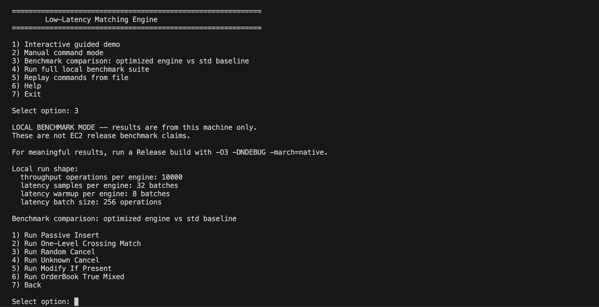

# Matching Engine

[](https://github.com/eric-zhou-tz/low-latency-matching-engine/actions/workflows/ci.yml)

A C++20 exchange-style matching engine built around deterministic price-time
priority, low-latency data structures, and reproducible Linux benchmarking.

The engine routes parsed order commands through an exchange layer, dispatches to
symbol-level order books, matches against resting liquidity with FIFO semantics,
and emits structured events for accepted orders, trades, cancels, modifies, and
rejects.

## Performance Highlights

Latest EC2 Release run: AWS `c7i-flex.large`, Ubuntu Linux, pinned core,
GCC/G++ 15.2.0, `-O3 -DNDEBUG -march=native`.

| Workload | Throughput |
| --- | ---: |
| Random cancel, 100,000 orders | `25.85M ops/sec` |
| One-level crossing match, 100,000 orders | `32.40M ops/sec` |
| True mixed OrderBook flow, 100,000 operations | `23.12M ops/sec` |
| End-to-end true mixed CLI-style flow, 100,000 commands | `2.21M commands/sec` |

Hot-path rows measure typed `OrderBook` work directly. End-to-end rows include
parsing, exchange routing, matching, and event formatting, so they are expected
to be lower.

See [BENCHMARKS.md](BENCHMARKS.md) for methodology, hardware, commit
provenance, and historical results.

## Architecture



Core flow:

```text
Command text -> Parser -> Exchange -> Symbol OrderBook -> Events/Formatting
```

`Exchange` owns symbol books and routes commands. `OrderBook` owns the
latency-sensitive matching state. The parser and output formatter sit outside
the hot path so the matching core can be benchmarked and tested directly.

Additional docs:

- [Architecture](docs/ARCHITECTURE.md)
- [Contributing](CONTRIBUTING.md)
- [Hot Path Analysis](docs/HOTPATH.md)
- [Benchmarks](BENCHMARKS.md)
- [Benchmark History](docs/benchmark_history.md)
- [Changelog](docs/CHANGELOG.md)

## Features

- Price-time priority matching
- GTC, IOC, and FOK limit orders
- Market orders
- Cancel and modify support
- Multi-symbol exchange routing
- Integer price and quantity types
- Deterministic replay fixtures
- Structured hot-path events
- GoogleTest and Google Benchmark coverage
- Docker validation and EC2 benchmark workflow

## Why Matching Engines Are Hard

- Fairness semantics must be explicit: better price first, FIFO within a price.
- Cancels and modifies can target any live resting order, not just the top.
- Mixed flow combines passive orders, taker orders, cancels, modifies, and rejects.
- Allocator churn and cache misses can dominate simple-looking operations.
- Replay output must stay deterministic while internals evolve.
- Parser, routing, matching, and formatting costs must be measured separately.

## Design Tradeoffs

| Choice | Tradeoff |
| --- | --- |
| `std::map` price levels | Deterministic ordered prices and direct best-level access, with `O(log n)` tree costs. |
| Intrusive FIFO price queues | Preserves time priority and enables O(1) unlink after lookup, at the cost of manual links. |
| Pooled order storage | Stable `Order*` handles and slot reuse reduce allocator pressure during churn. |
| Dense order-id maps | Cache-friendlier cancel/modify lookup than node-based maps, while order lifetime stays in the pool. |
| Structured events | Matching logic avoids string formatting; presentation work happens at the boundary. |

## Hot Path Optimizations

- Intrusive queues avoid same-price scans during cancels and fills.
- `OrderPool` reuses canceled or filled order slots.
- Dense hash maps make order-id lookup cache-conscious.
- Cancel routing maps live order ids directly to owning symbol books.
- Parser and formatter work are separated from direct `OrderBook` benchmarks.
- Caller-owned event buffers avoid fresh vectors for multi-fill submissions.

## Future Scaling Directions

The current engine is intentionally single-process and deterministic. The next
scaling steps would preserve that matching model while reducing ingress,
networking, and replay overhead:

- Partition symbols across matching shards so independent books can run on
  separate cores.
- Add lock-free ingress queues with explicit sequencing before commands enter a
  symbol book.
- Explore NUMA-aware placement for order pools, queues, and symbol ownership.
- Replace text command ingestion with a compact binary protocol for lower parse
  and allocation overhead.
- Add persistent replay logs for crash recovery and deterministic audit trails.
- Evaluate kernel-bypass networking only after the single-core matching path and
  replay semantics are fully stable.

## Benchmark Interpretation

- Hot-path benchmarks isolate the typed matching core.
- End-to-end benchmarks include parser, exchange, book, and formatting overhead.
- Microbenchmarks explain data-structure costs; mixed-flow benchmarks exercise
  more realistic command sequences.
- Batch latency rows are amortized per operation, not true single-order tail
  latency.
- Release benchmark numbers come from Linux/EC2, not local macOS runs.

## Profiling Snapshots

These flamegraphs come from pinned EC2 Release profiles using `perf` CPU-clock
sampling with `-O3 -DNDEBUG -march=native -fno-omit-frame-pointer -g`.

### Random Cancel Hot Path


Random cancel is dominated by `OrderBook::remove_resting_order`, with visible
time in dense-map erase, queue unlinking, and cancel event construction. That is
the expected pressure point for arbitrary-id cancellation: the engine must find
the live order, unlink it from its FIFO level, update aggregate level state, and
remove the id from lookup structures without scanning the book. The profile
keeps allocator impact limited by using pooled order storage and reusable event
buffers, while the remaining cost is mostly cache-sensitive hash-table and
price-level metadata updates.

### End-to-End True Mixed Flow


The end-to-end profile spreads work across workload generation, parser input
extraction, exchange routing, matching, and event formatting. `Parser::parse_line`,
`std::operator>>`, `format_event`, `std::to_string`, and small `malloc` samples
show the boundary cost that hot-path-only benchmarks intentionally exclude.
Inside the matching core, modifies, cancels, submits, and buy/sell matching paths
still appear as branch-heavy control flow because each command can accept, fill,
rest, cancel, reject, or touch multiple price levels.

## Quick Start

### Prerequisites

- CMake 3.20 or newer
- C++20 compiler such as GCC, Clang, or Apple Clang
- Docker for the recommended onboarding and validation path
- Ninja optional for faster native builds
- SQLite optional for inspecting benchmark history locally
- Linux `perf` tools optional for low-level benchmark counter analysis

CMake fetches GoogleTest, Google Benchmark, and `unordered_dense`
automatically during configure.

### Docker Quick Start

Docker is the recommended first path because it builds and validates the project
in a clean Ubuntu environment.

```bash
git clone https://github.com/eric-zhou-tz/low-latency-matching-engine.git
cd low-latency-matching-engine
docker build --target validation -t matching-engine-test .
docker run --rm matching-engine-test ctest --test-dir build --output-on-failure -C Release
docker run --rm -i matching-engine-test /bin/bash -lc \
  './build/matching_engine --model=fast < tests/replay_cli.txt'
```

For the full containerized smoke suite:

```bash
./scripts/docker_validate.sh
```

### Native CMake Build

```bash
git clone https://github.com/eric-zhou-tz/low-latency-matching-engine.git
cd low-latency-matching-engine
cmake -S . -B build -DCMAKE_BUILD_TYPE=Release
cmake --build build --config Release
```

Run the demo:

```bash
./build/matching_engine --model=fast < tests/replay_cli.txt
```

Run the interactive CLI:

```bash
./build/matching_engine
```

## CLI Flags

| Flag | Description |
| --- | --- |
| `--model=fast` | Optimized matching engine. This is the default. |
| `--model=toy-std` | Simple std-container baseline for comparison and regression checks. |

Example:

```bash
./build/matching_engine --model=toy-std < tests/replay_cli.txt
```

## Command Protocol

One command is accepted per line:

```text
SUBMIT <id> <symbol> <BUY|SELL> <price> <quantity> [GTC|IOC|FOK]
MARKET <id> <symbol> <BUY|SELL> <quantity>
CANCEL <id>
MODIFY <id> <new_price> <new_quantity>
PRINT
```

Behavior summary:

- `SUBMIT` defaults to `GTC`; IOC cancels unfilled remainder; FOK rejects unless
  the full quantity is immediately available.
- `MARKET` consumes available opposite-side liquidity and never rests.
- `CANCEL` removes an existing resting order by id.
- `MODIFY` updates an existing resting order by id.
- `PRINT` emits a readable snapshot of known books.

## Testing

```bash
ctest --test-dir build --output-on-failure -C Release
```

## Benchmarking

Release benchmark build:

```bash
cmake -S . -B build -G Ninja \
  -DCMAKE_BUILD_TYPE=Release \
  -DCMAKE_CXX_FLAGS_RELEASE="-O3 -DNDEBUG -march=native"

cmake --build build --config Release
```

Final benchmark validation is run on Ubuntu Linux/EC2 with CPU pinning. Docker is
used for Linux compatibility checks, not headline performance numbers.

## Docker Validation

```bash
docker build --target validation -t matching-engine-test .
docker run --rm -i matching-engine-test /bin/bash -lc \
  './build/matching_engine --model=fast < tests/replay_cli.txt'
./scripts/docker_validate.sh
```

The validation script builds a Release image, runs CTest, checks parser/replay
and CLI binaries, exercises advertised CLI flows, and launches short benchmark
sanity checks.

## Repository Tour

1. Start with this README for the project goals, quick start, command protocol,
   and validation paths.
2. Read [Contributing](CONTRIBUTING.md) before changing code, fixtures, or
   benchmarks.
3. Read [Architecture](docs/ARCHITECTURE.md) for the parser, exchange, and
   order book design.
4. Read [Benchmarks](BENCHMARKS.md) for the latest measured results,
   environment, build flags, and methodology.
5. Read [Hot Path Analysis](docs/HOTPATH.md) for the latency-sensitive matching
   path and data-structure notes.
6. Read [Benchmark History](docs/benchmark_history.md) for a lightweight guide
   to the SQLite-backed benchmark history.

## Repository Structure

```text
include/    Public headers
src/        Engine implementation
tests/      Unit, replay, and CLI tests
toy/        Simple std-container baseline
benchmarks/ Benchmark sources, EC2 runners, and history artifacts
docs/       Architecture, benchmark, and hot-path notes
CONTRIBUTING.md Contributor workflow and validation expectations
```
